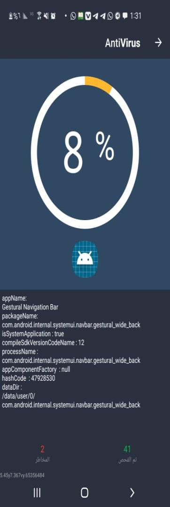
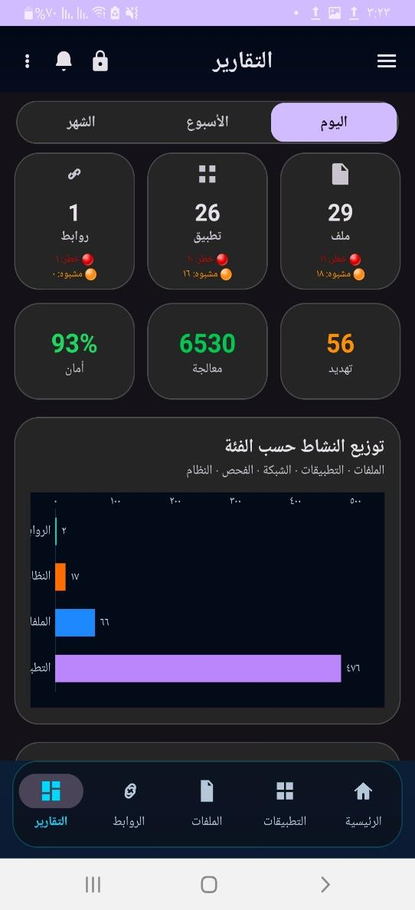
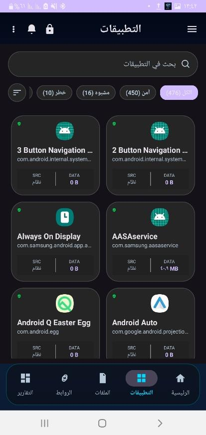

  

<h1 align="center">🛡️ GuardianX: Mobile Threat Intelligence & Security Ecosystem</h1>

  <b>Advanced Android Security Solution for the Zero-Trust Era.</b>

  
  
  
  

---

## 💎 The Premium Security Experience (UI Showcase)

> **Instructions**: Click on each module below to expand the full technical preview and high-definition interface explanation.

<b>📱 01. The Intelligent Dashboard (Real-time Analytics)</b>

  

### 📋 Technical Summary
The **Heuristic Dashboard** is the command center of GuardianX. It provides a **Security Score (0-100%)** calculated by the `SecurityScoreEngine`. 
- **Live Monitoring**: Instantly identifies background risks.
- **Visual Confidence**: Uses Material 3 design with "Glassmorphism" effects to prioritize user attention.
- **Dynamic Updates**: Changes colors based on risk level (Safe/Warning/Danger).

<b>🔍 02. Deep Forensic Scanner (Native YARA Engine)</b>

  

### 📋 Technical Summary
The core of our detection capability. Unlike traditional signature-based scanners, GuardianX uses a **Native C++ YARA Engine** ported for Android.
- **Byte-Level Inspection**: Scans binary structures for advanced persistent threats (APTs).
- **Specialized Modules**: Contains forensic logic for Office, PDF, and Executable files.
- **Performance**: Leverages multi-core processing via JNI for high-speed analysis.

<b>📊 03. Strategic Reports & Threat Mapping</b>

  

### 📋 Technical Summary
Security is about intelligence. The **Reporting Module** provides:
- **Trend Analysis**: Daily, weekly, and monthly security evolution charts.
- **Category Distribution**: Breakdown of threats (Malware vs. Phishing vs. Permissions).
- **History Tracking**: Permanent SQLite-backed records of every incident ever detected.

<b>🔐 04. The Encrypted Vault (Zero-Day Quarantine)</b>

  

### 📋 Technical Summary
When a file is suspicious but not confirmed, it is moved to the **Isolated Vault**.
- **Military Grade Encryption**: Files are encrypted with AES-256 locally.
- **OS-Level Isolation**: No other app can see or access the vaulted files.
- **Decryption Keys**: Managed via the user's secure master password, never stored in plain text.

---

## 🏗️ System Logic & Algorithms (The Architecture)

<table align="center">
  <tr>
    <td align="center"><b>Risk Engine Logic</b></td>
    <td align="center"><b>File Forensic Pipeline</b></td>
  </tr>
  <tr>
    <td></td>
    <td></td>
  </tr>
  <tr>
    <td><b>Multi-Vector Assessment</b>: How the system combines permissions, sources, and metadata into a single risk score.</td>
    <td><b>Sequential Forensic Analysis</b>: The step-by-step process of SHA-256 hashing, structure analysis, and YARA matching.</td>
  </tr>
</table>

---

## 📚 Comparative Studies (The Research)

| Feature | Legacy Antivirus | GuardianX (2026) |
| :--- | :--- | :--- |
| **Detection Method** | Signature Only | **Heuristic + AI + YARA** |
| **URL Security** | Blacklist only | **7-Layer Intelligence** |
| **AI Processing** | Cloud-based | **Local ONNX Execution (Privacy First)** |
| **Performance** | High Overhead | **Optimized Native C++ Layer** |

---

## 🛠️ Enterprise Tech Stack

*   **Logic**: Java 21 LTS (Android API 35)
*   **Performance Layer**: C++20 / CMake
*   **Security Library**: LibYara Native JNI
*   **AI Engine**: Microsoft ONNX Runtime Mobile
*   **Visual Framework**: Material 3 / Android Jetpack
*   **Database**: Room Persistence with SQLCipher

---

  
<b>GuardianX Pro</b> - Securing the Digital Frontier.

  
<i>Lead Developer: Mukhtar Alawady</i>

  

