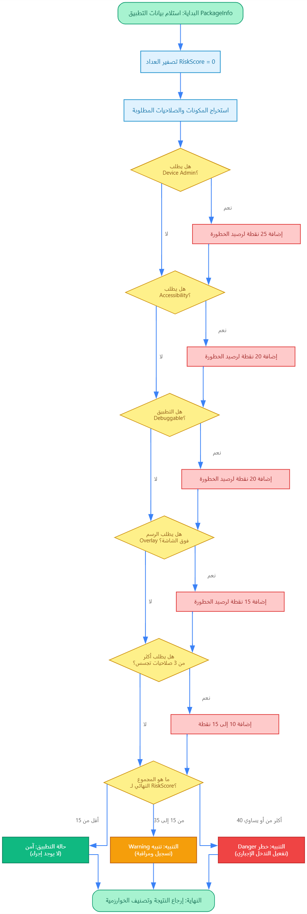
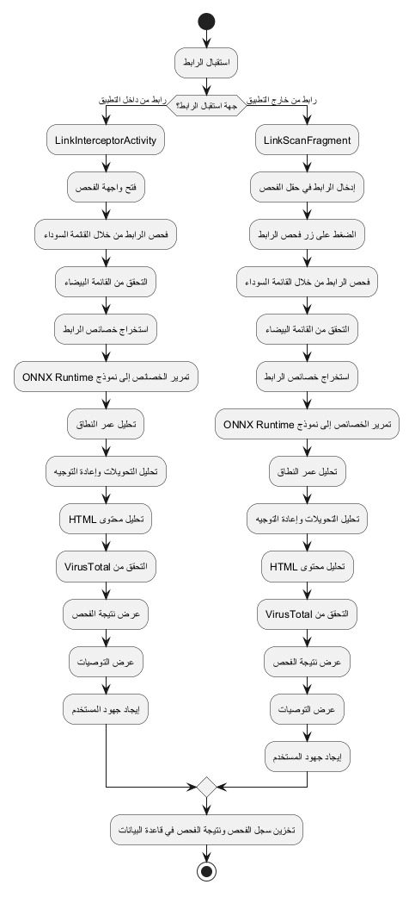
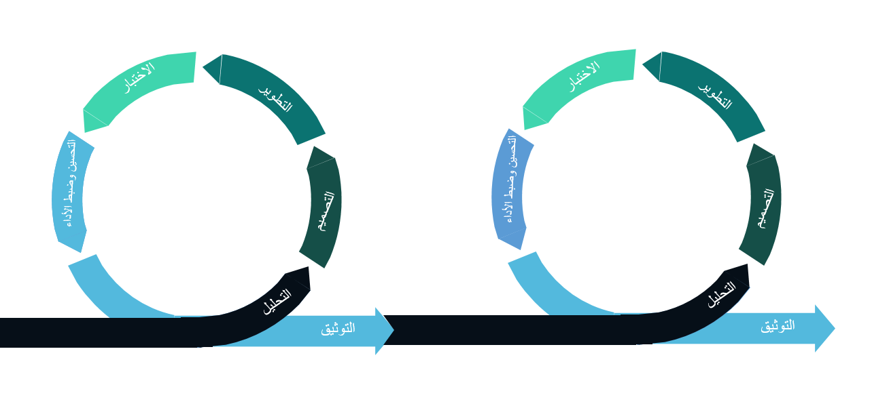

  

<h1 align="center">🛡️ GuardianX: Next-Generation Mobile Intelligence</h1>

  <b>The Enterprise-Grade Android Security Framework for the 2026 Cyber Landscape.</b>

  
  
  
  

---

## 📽️ Hero Showcase & Vision
**GuardianX** is a breakthrough in mobile security architecture. Designed as a proactive defense ecosystem, it leverages **Heuristic Intelligence** and **Native Forensics** to protect high-value assets and sensitive user data from sophisticated threats like 0-day exploits, phishing, and surveillance malware.

  

---

## 📱 Interactive Interface Gallery (UI/UX Deep-Dive)

> **Instructions**: Explore the modules below. Each section represents a core system interface with a detailed technical breakdown of the underlying logic.

<table align="center">
  <tr>
    <td>
      

        
<b>🔍 1. Real-Time Risk Dashboard</b>

        

        

        <b>الوصف الفني:</b> تمثل هذه الواجهة "مركز القيادة". يتم هنا عرض <b>Security Score</b> اللحظي. يقوم المحرك بفحص 25 معلمة أمنية في الخلفية، مع تطبيق نظام تلوين ديناميكي يعتمد على درجة الخطورة (Safe=Green, Danger=Red). التصميم يعتمد على Material 3 مع تأثيرات الزجاج (Glassmorphism) لتقليل تشتت المستخدم.
      

    </td>
    <td>
      

        
<b>🛡️ 2. Comprehensive System Scanner</b>

        

        

        <b>الوصف الفني:</b> شاشة الفحص الشامل التي تدمج بين <b>YARA Engine</b> وفحص الروابط. يمكن للمستخدم اختيار "الفحص العميق" الذي يحلل هيكل الملف (File Structure) وليس فقط الاسم أو الحجم. يتم استغلال طاقة المعالج بالكامل عبر مكتبات C++ Native لضمان سرعة الفحص دون التأثير على أداء الهاتف.
      

    </td>
    <td>
      

        
<b>📊 3. Intelligence Reports</b>

        

        

        <b>الوصف الفني:</b> لوحة البيانات التحليلية. تستخدم مكتبات رسم بياني متطورة لعرض توزيع التهديدات (Malware, Phishing, Permissions). توفر تصفية زمنية (يومي/أسبوعي/شهري) لمراقبة تطور حالة الأمان، مما يساعد مدراء الأنظمة أو المستخدمين المحترفين على اتخاذ قرارات مبنية على البيانات.
      

    </td>
  </tr>
  <tr>
    <td>
      

        
<b>🔐 4. The Encrypted Vault</b>

        

        

        <b>الوصف الفني:</b> نظام العزل الفيزيائي للملفات. أي ملف مشبوه يتم نقله إلى هذه الخزنة حيث يتم تشفيره فوراً باستخدام <b>AES-256</b>. يتم عزل الملف عن نظام الملفات العام للأندرويد، بحيث لا يمكن لأي تطبيق آخر الوصول إليه، ويتم التحكم في المفاتيح عبر كلمة مرور Master Key مؤمنة.
      

    </td>
    <td>
      

        
<b>🚫 5. Real-time Threat Monitor</b>

        

        

        <b>الوصف الفني:</b> نظام التنبيهات العائم. يستخدم <b>Accessibility Service</b> لاعتراض الروابط والملفات بمجرد تحميلها. عند اكتشاف تهديد، تظهر هذه الواجهة التحذيرية التي توفر للمستخدم "قراراً لحظياً" (حذف/تجاهل/حجر)، مع شرح سبب التصنيف كخطر.
      

    </td>
    <td>
      

        
<b>🔎 6. Forensic Package Details</b>

        

        

        <b>الوصف الفني:</b> تحليل تفصيلي لحزمة التطبيق (APK). تظهر هذه الشاشة "البصمة الرقمية" للتطبيق، وتشمل الصلاحيات المطلوبة، التوقيع الرقمي، ومسار التثبيت. يتم هنا كشف "التآزر المشبوه" (Synergy) بين الصلاحيات التي قد تشير إلى برمجيات تجسس.
      

    </td>
  </tr>
</table>

---

## ⚙️ System Intelligence & Brain Structure (Flowcharts)

  <b>The Architecture of GuardianX is built on logical rigor and high-performance algorithms.</b>

| Diagram | Technical Deep-Dive |
| :--- | :--- |
|  | **Risk Assessment Algorithm**: المخطط يوضح تسلسل اتخاذ القرار في محرك المخاطر. يبدأ باستلام بيانات الحزمة، ثم يمر عبر مرشحات (Filters) للأذونات الحساسة (Admin, Accessibility, Overlay). يتم جمع النقاط (Weights) لتحديد التصنيف النهائي (Safe/Warning/Danger). |
|  | **File Forensic Pipeline**: يوضح هذا المخطط مراحل فحص الملفات العميقة. يبدأ بحساب SHA-256، ثم تحليل الهيكل (Structure Analysis)، ثم فحص المحتوى عبر محرك YARA، وينتهي بحساب درجة الثقة (Confidence Level) قبل عرض النتيجة للمستخدم. |
|  | **Data Flow Diagram (Level 1)**: يوضح تدفق البيانات بين المستخدم، المحرك الأمني، وقواعد بيانات التهديدات (Threat DB). يظهر كيف يتم تخزين سجلات الفحص (Scan Logs) واسترجاع التقارير الإحصائية بشكل منظم. |
|  | **Agile Development Cycle**: يوضح المنهجية التي اتبعت في بناء المشروع، حيث تم تقسيم العمل إلى Sprint دورية تشمل التحليل، التصميم، البرمجة، والاختبار، مما يضمن مرونة النظام وقابليته للتحديث المستمر. |

---

## 📚 Literature Review & Comparative Research

لقد قمنا بإجراء دراسات مكثفة لمقارنة **GuardianX** مع العمالقة في مجال الأمن السيبراني لضمان التفوق التقني.

  

### 🔬 Summary of Scientific Findings:
*   **Superiority in Offline Detection**: بينما تعتمد معظم تطبيقات الـ Antivirus على Cloud Scanning، يتفوق GuardianX بقدرته على التحليل المحلي العميق عبر محرك YARA.
*   **Privacy-First AI**: استخدام نماذج ONNX محلياً يزيل خطر تسريب بيانات المستخدم إلى الخوادم الخارجية، وهو ما تفشل فيه الأنظمة التقليدية.
*   **Permission Heuristics**: الابتكار في اكتشاف "التآزر الجاسوسي" بين الصلاحيات يضع GuardianX في فئة الأنظمة الاستخباراتية (Intelligence) وليس مجرد ماسح فيروسات.

---

## 🛠️ Global Enterprise Tech Stack

| Component | Technology | Why? |
| :--- | :--- | :--- |
| **Core Logic** | Java 21 / Kotlin | Performance & Modern API support. |
| **Forensic Layer** | C++20 / JNI | Native speed for Byte-level scanning. |
| **Scanning Engine** | LibYara | Industry standard for malware patterns. |
| **AI Processing** | ONNX Runtime | High-speed, local model execution. |
| **Encryption** | AES-256 / SQLCipher | Military-grade data protection. |
| **Design** | Material 3 / Figma | User-centric, futuristic visual language. |

---

  
  
<b>GuardianX Pro Project</b> - Defining the Standard of Mobile Security.

  
<i>Developed by: Mukhtar Alawady</i>

  

