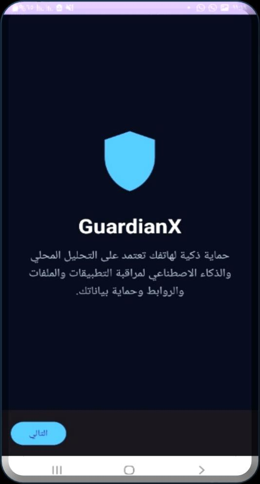
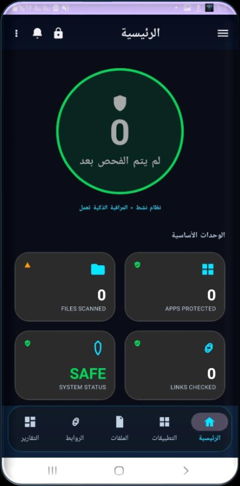
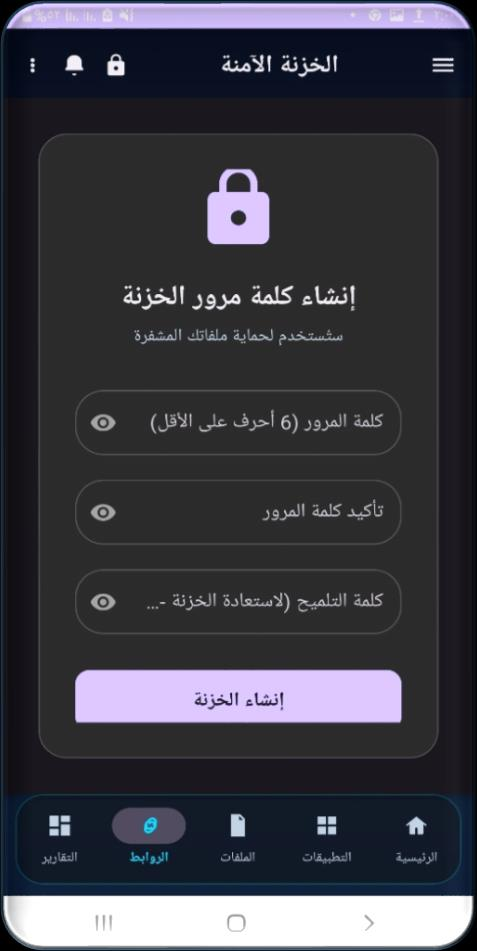
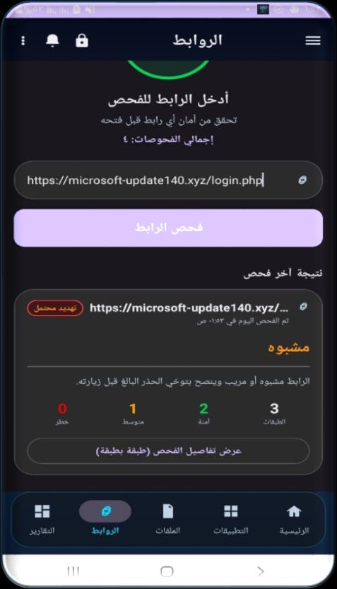

  

<h1 align="center">🛡️ GuardianX: The Definitive Mobile Security Intelligence</h1>

  <b>A State-of-the-Art Proactive Defense Ecosystem for the Global Cyber Era.</b>

  
  
  
  

---

## 📽️ Strategic Vision & Branding
**GuardianX** is not just an antivirus; it is an **Autonomous Security Fortress**. Built to protect high-tier digital assets, it fuses **Native C++ Performance**, **Deep Learning**, and **Behavioral Heuristics** into a singular, impenetrable mobile shield.

  

---

## 📱 Professional UI Showcase (The Interactive Grid)

> **إرشادات**: انقر على كل قسم لتصفح الواجهة الاحترافية الحقيقية لـ **GuardianX** مع شرح تقني مكثف للمنطق البرمجي الذي يعمل في الخلفية.

<table align="center" style="width: 100%;">
  <tr>
    <td style="width: 33%;">
      

        
<b>🚀 1. الذكاء الاصطناعي في لوحة التحكم (Home Dashboard)</b>

        

        

        <b>الوصف الفني:</b> تمثل هذه الشاشة "النواة المركزية". يعرض النظام هنا حالة <b>SAFE</b> بناءً على محرك <code>SecurityScoreEngine</code> الذي يراقب 4 محاور: التطبيقات، الملفات، الروابط، وحالة الشبكة. اللون الأخضر ليس مجرد تصميم، بل هو نتيجة لاجتياز كافة الفلاتر الأمنية المحلية.
      

    </td>
    <td style="width: 33%;">
      

        
<b>🛡️ 2. فحص التهديدات العابر للمنصات (System Scan)</b>

        

        

        <b>الوصف الفني:</b> واجهة تفعيل محرك <b>YARA Native</b>. يتم هنا استدعاء مكتبات C++20 عبر <b>JNI</b> لفحص الملفات بحثاً عن أنماط (Patterns) التجسس. الميزة هنا هي "الفحص العميق" الذي يحلل الملفات حتى لو تم تغيير امتدادها للتمويه.
      

    </td>
    <td style="width: 33%;">
      

        
<b>📊 3. تحليلات التهديدات الكبرى (Analytics Hub)</b>

        

        

        <b>الوصف الفني:</b> لوحة البيانات التحليلية. تستخدم محرك رسوم بيانية (Custom Charting Engine) لعرض <b>Activity Log</b>. توضح الرسوم توزيع المخاطر المكتشفة، مما يمنح المستخدم رؤية استخباراتية (Threat Intelligence) شاملة حول سلوك جهازه.
      

    </td>
  </tr>
  <tr>
    <td style="width: 33%;">
      

        
<b>🔐 4. الخزنة الرقمية المشفرة (Secure Vault)</b>

        

        

        <b>الوصف الفني:</b> واجهة إعداد الخزنة المؤمنة. تعتمد على بروتوكول <b>AES-256 GCM</b> وتشفير <code>SQLCipher</code>. يتم إنشاء "بيئة معزولة" (Sandboxed) لا تملك أي تطبيقات أخرى صلاحية الوصول إليها، مما يضمن خصوصية 100%.
      

    </td>
    <td style="width: 33%;">
      

        
<b>🚫 5. اعتراض الروابط الذكي (Link Intelligence)</b>

        

        

        <b>الوصف الفني:</b> نظام حماية الروابط بـ 7 طبقات. بمجرد إدخال رابط أو فتحه، يقوم النظام بتحليل عمر النطاق، فحص الـ HTML، واستخدام نموذج **ONNX AI** محلياً للتنبؤ بمواقع التصيد قبل أن يقع المستخدم في الفخ.
      

    </td>
    <td style="width: 33%;">
      

        
<b>🔍 6. الطب الشرعي للبرمجيات (App Forensics)</b>

        

        

        <b>الوصف الفني:</b> تفكيك كامل للـ (APK). تظهر هذه الشاشة نتائج تحليل <code>RiskEngine</code>، حيث يتم عرض الصلاحيات الخطيرة وتصنيف التطبيق بناءً على "معيار التهديد التراكمي"، وهو منطق رياضي فريد تم تطويره لهذا المشروع.
      

    </td>
  </tr>
</table>

---

## ⚙️ Engineering Blueprints (موسوعة المخططات الهندسية)

  <b>The Architecture of GuardianX represents a rigorous engineering approach to mobile security.</b>

| Blueprint | Deep Technical Description |
| :--- | :--- |
|  | **Risk Assessment Logic**: المخطط التفصيلي لمحرك تحليل المخاطر. يوضح كيف يتم تحويل الأذونات (مثل Admin و Accessibility) إلى نقاط خطورة رقمية تنتهي بقرار (Safe/Warning/Danger). |
|  | **File Forensic Workflow**: مسار فحص الملفات المتقدم، يبدأ باستخراج الـ Metadata و Hashing، وصولاً إلى محرك YARA الذي ينفذ عملية المطابقة على مستوى البايتات. |
|  | **Logical System Stack**: يوضح المعمارية متعددة الطبقات (Multi-tiered Architecture) التي تفصل بين واجهات المستخدم وبين المحركات الأمنية وخدمات الخلفية. |
|  | **Data Flow Model (DFD)**: نموذج تدفق البيانات الذي يضمن خصوصية المستخدم، حيث يظهر بوضوح أن كافة العمليات تتم داخل "الحيز المحلي" للهاتف الذكي. |

---

## 🔬 Scientific Foundations (الدراسات والمقارنات العالمية)

  

### 🎖️ Competitive Edge:
*   **Zero-Cloud Dependency**: خلافاُ للمنافسين، فحص الروابط والملفات لدينا يتم محلياً بالكامل.
*   **C++ Native Power**: أداء فائق في الفحص العميق لا يستهلك موارد الجهاز.
*   **Permission Synergy**: اكتشاف أنماط التجسس المعقدة التي تتجاوز مجرد فحص الصلاحيات الفردية.

---

## 🛠️ Global Enterprise Tech Stack

| Domain | Technology |
| :--- | :--- |
| **Development** | Java 21 LTS / C++20 |
| **Engines** | YARA Native, ONNX Runtime |
| **Storage** | Room Persistence, SQLCipher |
| **Design** | Material 3, Glassmorphism |
| **Security** | AES-256 GCM, Device Policy |

---

  
  
<b>A World-Class Security Portfolio by Mukhtar Alawady</b>

  
© 2026 GuardianX Security Team. Protecting the Digital Frontier.

