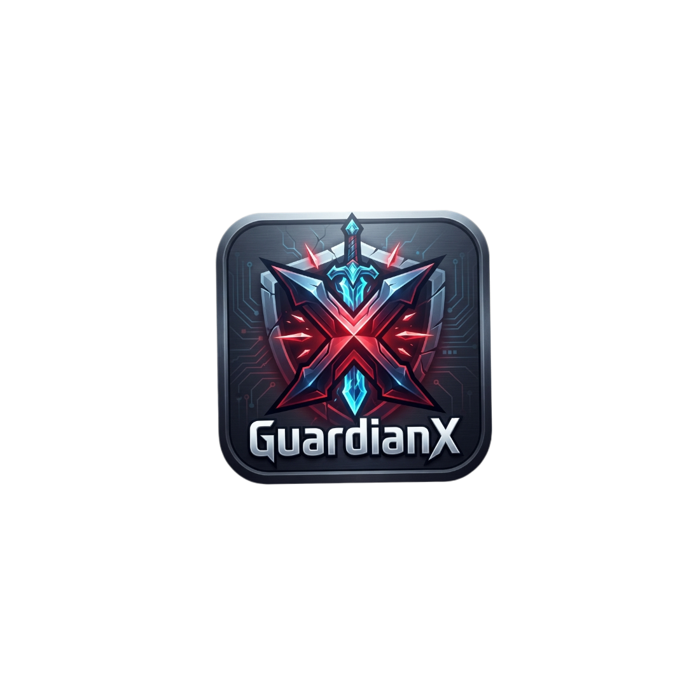
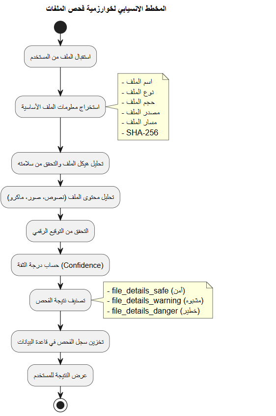

  

<h1 align="center">🛡️ GuardianX: The Sentinel of Android Security</h1>

  <strong>An Intelligent, Multi-Layered Threat Intelligence & Forensic System for Modern Mobile Environments.</strong>

  
  
  
  

---

## 📖 Overview
**GuardianX** is not just an application; it's a comprehensive security infrastructure designed to combat the evolving landscape of mobile threats. Developed as a high-end graduation project, it integrates **Native C++ Forensics**, **Heuristic Risk Engines**, and **Deep Learning** to provide a zero-compromise security experience.

> 🔒 **Security Notice**: This repository acts as a **Technical Showcase**. The proprietary source code is hosted in a private, encrypted environment to protect intellectual property.

---

## 📱 Visual Experience

  
  

---

## 🚀 Core Capabilities (The Pillars)

### 🧠 1. Heuristic Risk Assessment
Our custom **RiskEngine** performs multi-vector analysis on applications:
*   **Behavioral Auditing**: Detects dangerous permission combinations (e.g., Camera + SMS + Internet).
*   **Sideload Verification**: Identifies apps installed outside of official stores.
*   **Component Inspection**: Scans background services and receivers for hidden activities.

### 🌐 2. 7-Layer URL Intelligence
A military-grade scanning pipeline for links and phishing attempts:
1.  **Metadata Check**: Analyzing domain age and registration patterns.
2.  **AI Analysis**: Utilizing a local **ONNX model** to inspect 43 structural URL features.
3.  **Cloud Sync**: Live validation via **VirusTotal API** (leveraging 90+ global scanners).

### 🔍 3. Deep File Forensics (YARA Integration)
We've ported the world-renowned **YARA Engine** to Android using **C++20**:
*   **Static Pattern Matching**: Finding malware signatures at the byte level.
*   **Specialized Forensic Modules**: Deep inspection of Office, PDF, and Image files.

---

## 🛠️ System Architecture & Logic

### 🔄 Algorithm Workflows

  
  

<b>📐 Technical Stack 2026</b>

- **Language**: Java 21, C++20 (JNI)
- **AI Framework**: ONNX Runtime Mobile
- **Forensics**: LibYara Native
- **Storage**: SQLCipher / Room (Local Encryption)
- **Architecture**: Clean Architecture / MVVM

---

## 📂 Project Resources

| Category | Link | Description |
| :--- | :--- | :--- |
| **Documentation** | [📚 Technical Docs](docs/) | Architecture, ERD, and Security Engine logic. |
| **Reports** | [📄 Official Reports](reports/) | Comprehensive PDF & Word project reports. |
| **Assets** | [🖼️ Branding](assets/) | Brand identity and UI elements. |

---

## 👤 Development Team
**Lead Architect**: Mukhtar Alawady
**Focus**: Mobile Security, Malware Analysis, and AI Integration.

---

  <b>GuardianX Pro</b> • Protecting your Digital Frontier in 2026 and Beyond.

  
  

