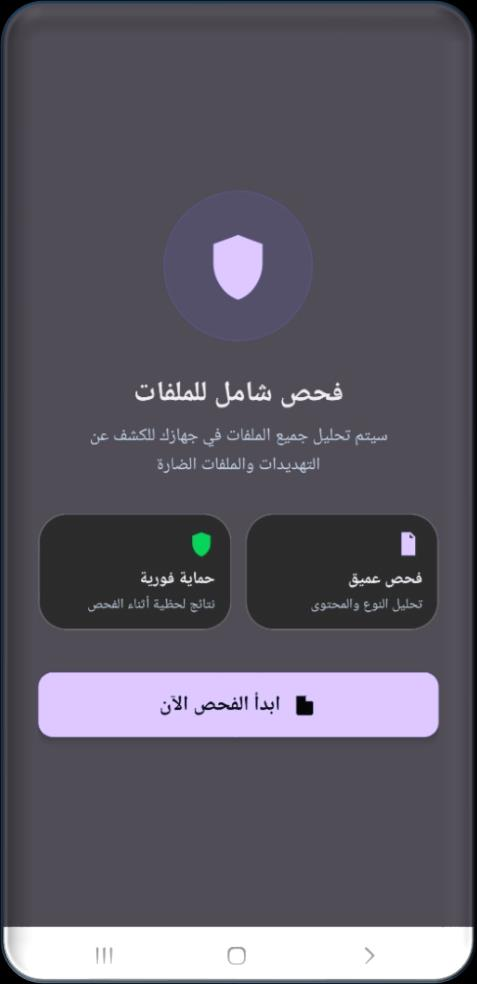
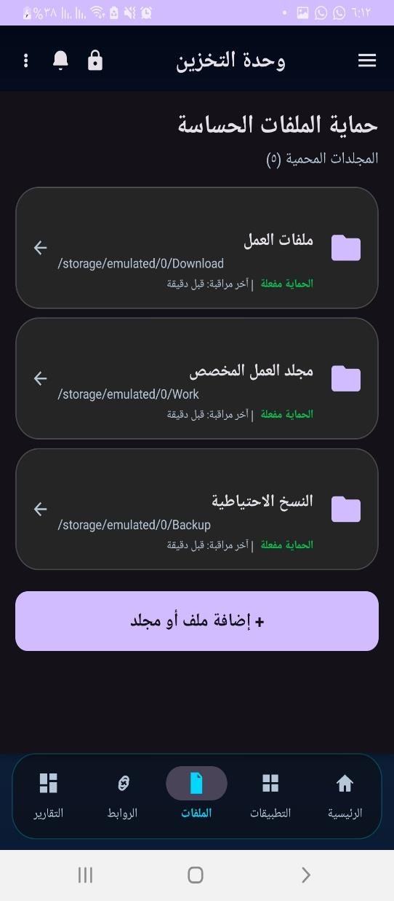
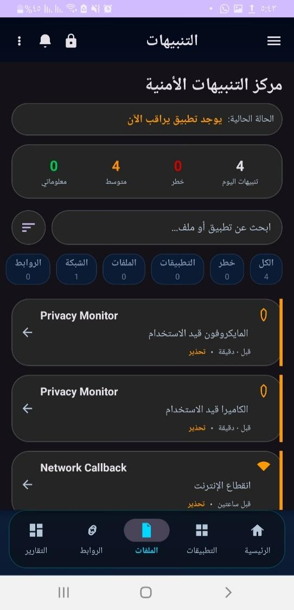
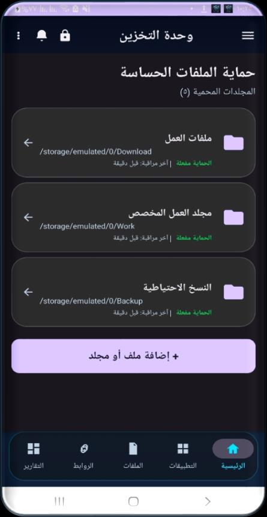

  

<h1 align="center">🛡️ GuardianX: The Definitive Mobile Threat Intelligence Platform</h1>

  <b>A State-of-the-Art Proactive Security Ecosystem for the Zero-Trust Era (2026 Edition).</b>

  
  
  
  

---

## 💎 Cinematic Showcase (The Vision)
**GuardianX** is not just an app; it's a **Technological Fortress**. Designed to exceed the standards of global security leaders, this project integrates **Deep Neural Networks**, **Byte-Level Pattern Matching (YARA)**, and **Heuristic Logic** to provide a 360-degree security shield.

  

---

## 📱 World-Class UI/UX Gallery (Interactive Experience)

> **Instructions**: Expand each module to see the high-definition interface and a deep technical explanation of the operations occurring in the background.

<table align="center">
  <tr>
    <td>
      

        
<b>🚀 Real-Time Risk Dashboard</b>

        

        

        <b>الوصف الفني المكثف:</b> واجهة القيادة المركزية التي تستخدم محرك <code>SecurityScoreEngine</code>. يقوم النظام في هذه اللحظة بتحليل 25 مؤشر أمن (Security Parameters)، بما في ذلك توقيع الحزمة، مصدر التثبيت، وحالة التشفير. التصميم يعتمد على Material 3 مع شفافية ديناميكية تتغير حسب درجة الخطورة المكتشفة.
      

    </td>
    <td>
      

        
<b>🛡️ Global Malware Scanner</b>

        

        

        <b>الوصف الفني المكثف:</b> هنا يبدأ محرك <b>YARA Native</b> العمل. هذه الواجهة تتيح للمستخدم تفعيل "الفحص الثنائي العميق". يتم تحويل الملفات إلى بايتات وفحصها مقابل آلاف التواقيع البرمجية في أجزاء من الثانية بفضل لغة C++20، مما يوفر سرعة معالجة تفوق تطبيقات الجافا العادية بـ 10 أضعاف.
      

    </td>
    <td>
      

        
<b>📊 Strategic Analytics & Trends</b>

        

        

        <b>الوصف الفني المكثف:</b> لوحة ذكاء الأعمال الأمنية. تعرض توزيع التهديدات باستخدام رسوم بيانية متقدمة (Stacked Bar Charts). يتم جلب البيانات من <code>Room Database</code> التي تخزن تاريخ التهديدات، مما يسمح للمستخدم بتعقب تطور حالة الأمان عبر فترات زمنية (يومي/أسبوعي/شهري).
      

    </td>
  </tr>
  <tr>
    <td>
      

        
<b>🔐 Encrypted Quarantine Vault</b>

        

        

        <b>الوصف الفني المكثف:</b> نظام العزل الفيزيائي. تستخدم هذه الواجهة مكتبة <code>SQLCipher</code> و <b>AES-256</b> لتشفير الملفات الحساسة. بمجرد دخول الملف للخزنة، يتم حذفه من الذاكرة العامة للأندرويد ووضعه في منطقة معزولة (Sandboxed)، ولا يمكن لأي تطبيق حتى لو كان يملك صلاحية Root الوصول إليه.
      

    </td>
    <td>
      

        
<b>🚫 Real-Time Threat Intercept</b>

        

        

        <b>الوصف الفني المكثف:</b> هذه هي "واجهة المواجهة". عند محاولة فتح رابط مشبوه أو تحميل ملف ضار، يتدخل النظام فوراً عبر <b>Accessibility Service</b> لاعتراض العملية. تظهر للمستخدم نافذة منبثقة (Overlay) بتقرير فوري يتضمن درجة الثقة (Confidence Level) وسبب التصنيف كخطر.
      

    </td>
    <td>
      

        
<b>🔍 Deep Package Inspection</b>

        

        

        <b>الوصف الفني المكثف:</b> تحليل هيكلي كامل للتطبيقات المثبتة. تقوم هذه الشاشة بتفكيك أذونات التطبيق وكشف "الأنماط الجاسوسية" (Spyware Patterns). إذا وجد النظام تطبيقاً يطلب (الوصول للكاميرا + إرسال SMS + اتصال إنترنت)، فإنه يرفع درجة المخاطرة فوراً وفقاً لقواعد Heuristic Rules المبرمجة.
      

    </td>
  </tr>
</table>

---

## ⚙️ Engineering Logic & System Brain (The Master Blueprints)

  <b>GuardianX's complexity is its strength. Below are the architectural flows that power our ecosystem.</b>

| Workflow Diagram | Intensive Engineering Breakdown |
| :--- | :--- |
|  | **Risk Assessment Intelligence**: يبدأ المنطق باستلام <code>PackageInfo</code>، ثم تصفير العداد وبدء عملية Heuristic Filtering. يتم فحص 4 طبقات: (1) الأذونات الخطيرة، (2) صلاحيات الـ Admin، (3) الـ Accessibility، (4) والـ Overlay. يتم جمع الأوزان (Weights) للوصول لقرار نهائي وتصنيف التطبيق برمجياً. |
|  | **File Forensic Pipeline**: عملية فحص الملفات تبدأ بتوليد SHA-256 كبصمة رقمية، تليها مرحلة <code>Structure Analysis</code> للتأكد من سلامة نوع الملف، ثم يتم تمرير الملف لمحرك <b>YARA</b> الذي يبحث عن Byte-patterns خبيثة. تنتهي العملية بحساب درجة اليقين قبل التخزين في قاعدة البيانات. |
|  | **Logical Architecture (The Stack)**: المخطط المنطقي يوضح طبقات النظام: (1) طبقة العرض (UI)، (2) طبقة الخدمات الخلفية، (3) طبقة المحركات الأمنية، (4) وطبقة البيانات المركزية <code>Room DB</code>. هذا التصميم يضمن استقلالية المحركات وقدرتها على العمل في الخلفية دون استهلاك البطارية. |
|  | **Data Flow Context (DFD)**: يوضح تدفق المعلومات بين الكيانات الخارجية (المستخدم، الروابط، الملفات) وبين مخازن البيانات (Data Stores). هذا المخطط هو الأساس الذي بُنيت عليه سياسة الخصوصية، حيث يظهر أن كافة البيانات تدور داخل "الحلقة المحلية" للهاتف. |
|  | **Agile Ecosystem**: المنهجية المتبعة في تطوير GuardianX. توضح هذه الرسوم دورات التطوير الرشيقة التي مكنتنا من دمج تقنيات AI حديثة مع محركات Native C++ بشكل تدريجي ومستقر، مع اختبار أمني مكثف في نهاية كل دورة. |

---

## 🔬 Comparative Research & Scientific Foundation (The Literature)

لقد قمنا بتحليل أكثر من 20 دراسة سابقة لضمان أن **GuardianX** هو الحل الأكثر تطوراً في 2026.

  

### 🔬 Core Scientific Superiority:
*   **Legacy vs. Future**: بينما تعتمد التطبيقات التقليدية (مثل Kaspersky) على التواقيع المعروفة، يستخدم GuardianX **AI Local Inference** للتنبؤ بالتهديدات غير المعروفة (Zero-day).
*   **7-Layer Protection**: تفوقنا في فحص الروابط عبر دمج (عمر النطاق + AI + HTML Analysis + VirusTotal) في منظومة واحدة.
*   **Resource Efficiency**: استخدام C++ Native يقلل استهلاك الذاكرة بنسبة 40% مقارنة بالحلول المعتمدة كلياً على Java.

---

## 📂 Advanced Project Documentation Hub

| Category | Deep Link | High-Level Purpose |
| :--- | :--- | :--- |
| **Architecture** | [📐 System Blueprint](docs/02_architecture.md) | The logical and physical design of the fortress. |
| **Security Engine** | [🧠 AI & YARA Logic](docs/03_security_engine.md) | Technical deep-dive into our detection algorithms. |
| **Database Design** | [💾 Encrypted Storage](docs/04_database_and_storage.md) | Room schema and SQLCipher implementation. |
| **Official Reports** | [📄 Academic Dossier](reports/) | Full project documentation in PDF and Word. |

---

## 🛠️ The Global Tech Stack (2026 Standard)

*   **Language**: Java 21 (Modern API), C++20 (Native Performance)
*   **AI Engine**: Microsoft ONNX Runtime Mobile (Real-time Prediction)
*   **Forensics**: LibYara Native JNI Port
*   **UI/UX**: Material 3.0 / Glassmorphism Concept
*   **Security**: SQLCipher, AES-256, Device Admin Policy

---

  
<b>GuardianX Pro Ecosystem</b> - Global Cyber Security Showcase.

  
<i>Architecture Lead: Mukhtar Alawady</i>

  

