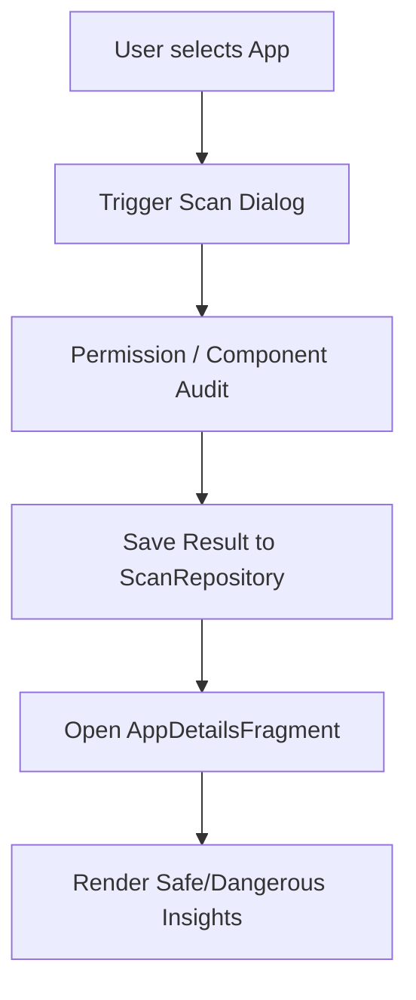

# GuardianX - User Interface, Screens, and Navigation Flows

This document outlines the user interface components, layout integration, and core user flows within **GuardianX**.

---

## 1. Interface Infrastructure (`MainActivity.java`)
`MainActivity` serves as the primary controller for layout updates, transitioning between views dynamically using Fragment transactions. It utilizes two main visual navigation components:
- **BottomNavigationView**: Quick access to high-frequency views:
  - **Home (المحرّك)**: Circular dial showing safety level.
  - **File Scan (فحص الملفات)**: Scan custom storage segments.
  - **Scan (فحص التطبيقات)**: Audit lists of installed applications.
  - **More (المزيد)**: Additional security tools and version parameters.
- **DrawerLayout (Navigation Drawer)**: Slide-out menu coordinating secondary system modules:
  - **Secure Vault (الخزنة الرقمية)**: Local secure vault database.
  - **Link Scan (فحص الروابط)**: Audit suspicious domain URLs.
  - **Storage Explorer (المستكشف)**: File explorer navigation tree.
  - **Alerts (التنبيهات)**: Aggregated alerts.
  - **Reports (التقارير)**: Graphical charts representation.
  - **Settings (الإعدادات)**: App controls, permissions toggle.

---

## 2. Core User Flows and Navigation Diagrams

### A. Application Scanning Flow
1. User clicks the **Scan** tab.
2. The UI renders the list of installed applications (`AppsFragment`) via a recyclerview containing application icons, names, and installers.
3. User selects an application or triggers "Scan All".
4. A customized overlay dialog (`ScanDialogFragment`) appears with a progress animation, showing the package being evaluated in real-time.
5. Once complete, the data executes inside the `ScanRepository`.
6. Tapping a finished row opens `AppDetailsFragment`, displaying positive insights (e.g., "From Google Play") and negative warnings (e.g., "Synergy Risk: Camera + Microphone + Web Access requested").

### B. File Navigation & Scan Flow
1. User opens **Storage Explorer**.
2. The UI lists files (`StorageExplorerFragment`).
3. User checks files. Tapping a file triggers a hash analysis.
4. If a threat is found, a notification is sent to the system tray.
5. Tapping the scan target details launches `FileDetailsFragment`, rendering:
   - File Name & Extension.
   - Calculated SHA-256 Hash.
   - Threat Verdict (`"SAFE"`, `"SUSPICIOUS"`, or `"MALICIOUS"`).
   - Timestamp and absolute file path.

---

## 3. Foreground Service Notification Callbacks (معالجة الإشعارات)
When a background file change or package installation is detected, the `RealtimeProtectionService` launches a system tray notification.
1. The user taps the notification.
2. The notification triggers an intent to launch `MainActivity` with action `ACTION_VIEW_FILE_DETAILS` and multiple string extras (`file_name`, `file_sha`, `file_status`, etc.).
3. `MainActivity.onCreate()` (or `onNewIntent()`) receives the intent and forwards it to `handleIntent()`.
4. `handleIntent()` extracts the extras, initiates a `FileDetailsFragment` transaction, and sets the toolbar title.

---

## 4. Device Administrator Activation Flow
To defend the system from silent removal, a background timer checks the administration state:
1. Two seconds after the main dashboard loads, a handler runs `isDeviceAdminEnabled()`.
2. If the app is not registered as a Device Admin, `requestDeviceAdminPermission()` launches the system prompt `DevicePolicyManager.ACTION_ADD_DEVICE_ADMIN`.
3. The prompt displays a custom warning explaining why administrative permissions are required (e.g., remote lock capabilities, camera restriction).
4. The user's input returns via `onActivityResult()` under code `REQ_DEVICE_ADMIN`, updating the status and logs.
